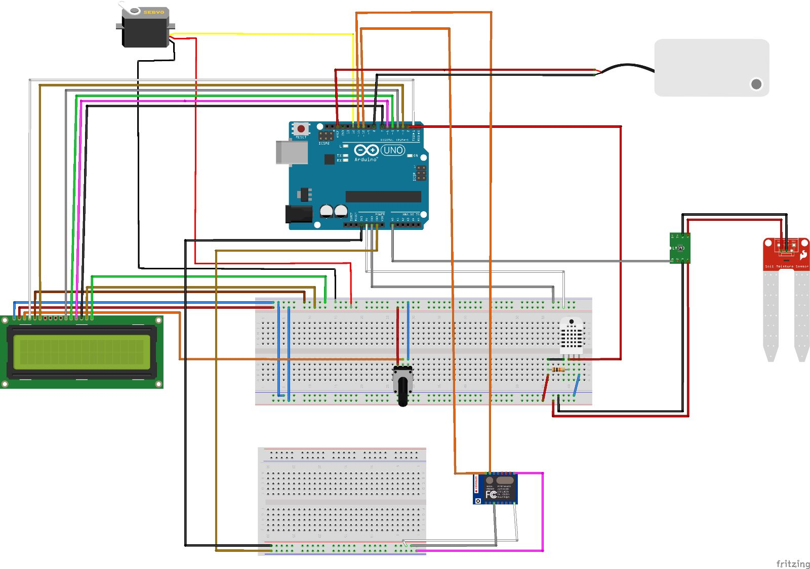

# Smart-Plant-Caring-System
This project is for CMPE 331 class. You can see the details of the project inside of the project report (pdf) file.

# Data
For checking the data online use this [link.](https://thingspeak.com/channels/1985536)

# Design
This is the connection design of the system.

# TO DO
- Add test conditions.
